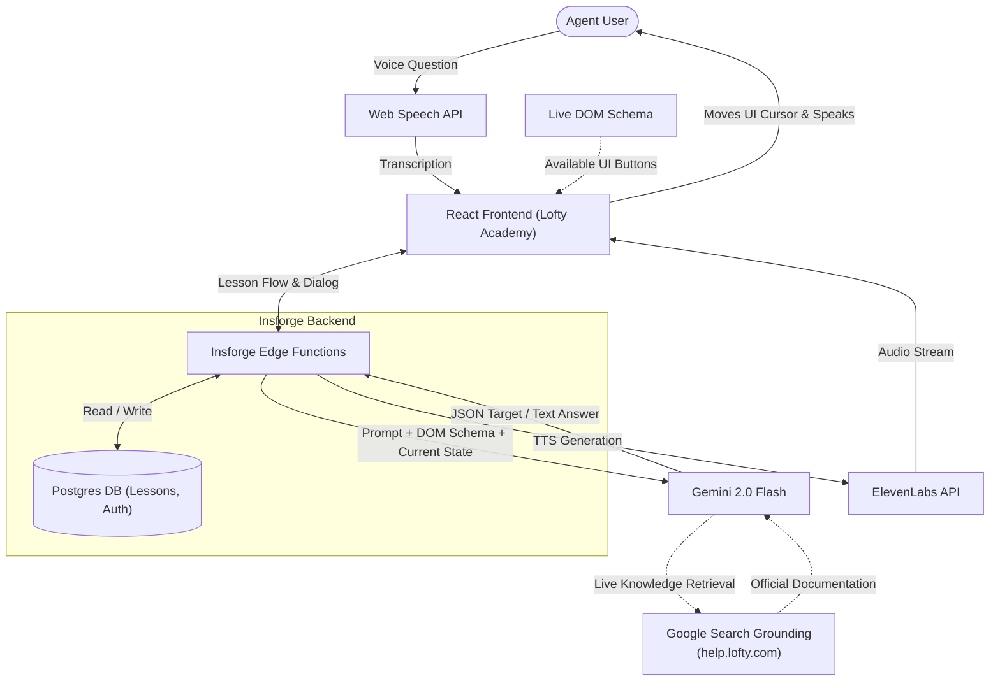

# 🎓 Lofty Academy — AI-Native Onboarding Flow

**Team:** Agent Reborn  
**Track:** Lofty MVP Track — "Onboarding Flow"  
**🚀 Live Demo:** [https://agent-reborn.vercel.app](https://agent-reborn.vercel.app)

Lofty Academy reimagines how real estate agents first experience Lofty. Instead of watching passive tutorial videos or navigating static tooltips, agents are guided by a continuous, voice-enabled AI tutor that operates the CRM interface in real-time alongside them. 

We focused on the **Onboarding Flow** to solve the primary bottleneck of software adoption: giving users an interactive, hands-on "Aha!" moment on day one, building immediate trust in the AI capabilities.

## 🎯 The Core "Aha!" Moment
> The AI is currently moving the cursor to show the user how to build a Smart Plan.  
> **User Interrupts via Voice:** *"Wait, what actually is a Smart Plan?"*  
> **System Response:** The lesson instantly pauses. The AI tutor naturally answers the question using ElevenLabs text-to-speech, grounded in real Lofty documentation, and then asks, *"Shall I continue the walkthrough?"* The lesson resumes exactly where it left off.

## 🏗️ Technical Architecture & Innovation

To make this product infinitely scalable (so Lofty never has to manually write another onboarding tutorial), we engineered a closed-loop RAG pipeline:



1. **Google Search Grounding:** Gemini actively searches `help.lofty.com` live to retrieve official knowledge for answering user questions and scraping release notes. It generates lessons directly from Lofty's own published documentation.
2. **Live DOM Schema:** Instead of using a hardcoded `CRM_SCHEMA`, the system scans the actual React DOM currently on the screen. It maps what buttons and navigation elements are *actually* visible, preventing the AI from hallucinating UI actions.
3. **The Result:** We achieve an AI that possesses **real-time Help Center knowledge AND real-time UI awareness**. Whenever Lofty ships a feature or updates a help article, Lofty Academy autonomously updates its interactive lessons without human intervention.


## 🛠️ Tech Stack & Requirements Met

We built a production-ready AI application heavily utilizing **Insforge** as our primary backend, fulfilling the submission deliverables:

### 1. Insforge Backend Implementations
*   **Auth (Profiles):** Our demo login queries the Insforge `profiles` table to authenticate the user dynamically.
*   **Database (Postgres):** All interactive lessons, user completion progress, Q&A events, and content sources are persisted in Insforge Postgres.
*   **Edge Functions:** We rely on Insforge Edge Functions for secured AI execution:
    *   `speak-lesson`: Converts dynamic script texts into ElevenLabs MP3 voice streams.
    *   `answer-question`: Connects to Gemini 2.0 Flash to process user interrupts.
    *   `generate-lesson`: Ingests release notes and generates the strict JSON lesson steps using Gemini.

### 2. External APIs
*   **Google Gemini 2.0 Flash:** Drives the AI Tutor's brain for both Q&A generation and programmatic lesson generation.
*   **ElevenLabs Multilingual v2:** Powers the low-latency, conversational voice synthesis of the tutor.
*   **Web Speech API:** Provides continuous, hands-free microphone input so users can interrupt the lesson naturally.

## 💼 The Business Case
Traditional product adoption relies on Customer Success Managers (CSMs) spending hundreds of hours onboarding new brokerages, or providing passive Zendesk articles that agents rarely read. 
*   **Lower Support Costs:** By introducing an interactive AI tutor, Tier 1 support tickets regarding "how to use a feature" are drastically reduced.
*   **Higher Feature Adoption:** Agents learn by doing rather than watching, meaning they activate sticky features (like Smart Plans and AI Copilots) faster, increasing long-term retention. 
*   **Scalability:** Because of the RAG pipeline, the cost to create onboarding tutorials for new features drops to zero.

## 🚀 Quick Start (Local Development)

```bash
# Install dependencies
npm install

# Copy env file and insert your Insforge + Gemini + ElevenLabs variables
cp .env.example .env.local

# Run the local frontend
npm run dev

# (Optional) Deploy edge functions
insforge functions deploy speak-lesson
insforge functions deploy answer-question
insforge functions deploy generate-lesson
```

## 📜 License
Built for GlobeHacks 2026 by Team Agent Reborn.
